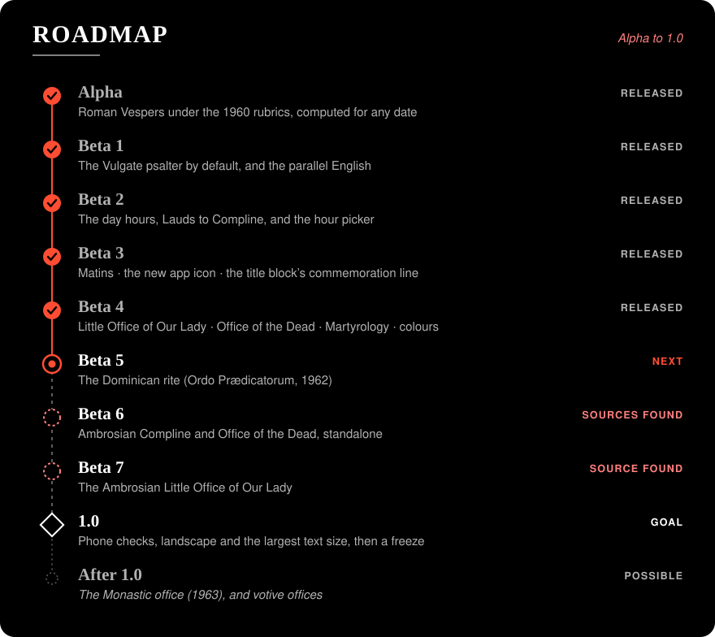

# Breviarium

An iPhone app for the traditional Divine Office, modelled on Universalis's night
mode but giving the pre-conciliar office: the *Breviarium Romanum* under the **1960
rubrics**, with the Universal Calendar, the Vulgate psalter (the Pius XII psalter is an
option), and an optional parallel English translation. The app computes the office
itself for any date. It is fully offline and night mode only.
For now it is built and used privately and installed by sideloading with a free Apple ID;
a public release on the App Store is planned.

## Status: 1.0

1.0 (10 October 2026) completes the first roadmap. It adds **Ambrosian Compline**
(*Completorium Ambrosianum*, from the 1957 breviary, by Church of Ambrose's transcription
and with its owners' permission), following the Ambrosian calendar with its own Sundays,
feasts and colours; English side by side throughout but for the Matins lessons; more
directions in red; and six app icons.

The whole Roman office is here: Matins, Lauds, Prime, Terce, Sext, None, Vespers and
Compline, in Latin with an optional English translation, in either psalter. Beta 5 added
**the Dominican office** (Divinum Officium's *Ordo Prædicatorum - 1962*): every hour with
the Order's calendar, saints, commons and hymns, its Little Office and Office of the
Dead, both psalters, and the Order's English where it exists (else the Roman English of
the same text, with a small grey note where the Dominican Latin differs). Beta 4 added
the offices said beside the Roman office of the day:

- **The Little Office of Our Lady**, all eight hours, in its Advent, Christmas, Lenten
  and ordinary forms.
- **The Office of the Dead**: Matins, Lauds and Vespers.
- **The Martyrology**, read at Prime on the eve, as an "hour" of its own after *Ad
  Primam* in the day's office.
- **The liturgical colour**: *Jump to date* is a month grid with a dot of each day's
  colour.
- Directions inside a text, such as *(Fit reverentia)*, are red rubrics.

Settings → *Ritus* → *Romanus* or *Dominicanus* chooses the rite and the office: the
office of the day, the Little Office or the Office of the Dead.

- **The office is right.** For every day from 2025 to 2040, each hour is checked against
  [Divinum Officium](https://github.com/DivinumOfficium/divinum-officium)'s own output:
  - everything the engine shows is on DO's page, and nothing on DO's page is missing, in
    Latin and in English, with each Latin-English pair in the same row;
  - each psalm's title and verse list, in both psalters;
  - the day title, including evenings that already belong to the next day's office, and
    the line under it (the commemoration, the season's Scripture, a transferred feast);
  - Vespers' commemorations, and at Lauds those said at Lauds only.

  The Dominican office is checked the same way, every hour from 2025 to 2040; where
  DO's Dominican data is in error the app shows the corrected text, each case listed in
  [`docs/rubrics-op1962.md`](docs/rubrics-op1962.md). The Little Office (2026–2027) and
  the Office of the Dead (2026) are checked the same way under both rites, and the Martyrology against every Prime page. All of 2044 is checked too, with the priest form on and off, as an out-of-sample year
  the engine was never tuned against. So are `CLAUDE.md`'s named edge cases, hour by
  hour: Tenebræ, All Souls, Our Lady on Saturday, the Greater Litanies on St Mark,
  transferred feasts and the rest.
- **Matins** has its invitatory, hymn, nocturns with their lessons and responsories, and
  the *Te Deum*, as the 1960 rubrics order them: nine lessons on I and II class days,
  three on the rest.
- **The app** opens on the hour for the time of day (Matins until 05:00, Lauds until 09:00, Terce until 12:00,
  Sext until 15:00, None until 17:00, Vespers until 20:00, then Compline). Tapping the
  hour's name at the top opens the list of hours. Every hour reads the same way:
  - The office reads like a book: pages turn sideways (a slide or a page curl) and the
    text flows line by line from one page to the next. A continuous vertical scroll is
    available instead.
  - With English on, Latin and English run side by side, with the chapter, collect and
    lessons stacked in portrait. With the Pius XII psalter, each psalm's English is shown whole
    beside it.
  - The layout follows `design/reference/`: the date line, day title, table of contents,
    section headings, and a *Page N of M* footer.
- **Settings:**
  - *Sacerdos vel diaconus adest* (*Dominus vobiscum* or *Domine, exaudi*)
  - *Rubricæ* (show or hide rubrics)
  - English translation (on or off)
  - *Psalterium* (Vulgata or Pii XII)
  - Text size
  - Scrolling (horizontal pages or vertical scroll)
  - Page turn (slide or page curl)
  - *Ritus*: Romanus or Dominicanus, each with its *Officium* (of the day, the Little
    Office or the Office of the Dead), or Ambrosianus, with *Completorium Ambrosianum*
  - App icon: Default, Benedictus, Gutenberg (mono), Gutenberg, ChurchofAmbrose or
    Weissenau, chosen from a gallery of all six
  - Release notes, and About with the Divinum Officium licence

The build log, with every decision and every bug traced to the Divinum Officium source
it was checked against, is in [`docs/PLAN.md`](docs/PLAN.md). What went right and wrong,
and what to carry forward, is in [`docs/alpha-retrospective.md`](docs/alpha-retrospective.md),
[`docs/beta-1-retrospective.md`](docs/beta-1-retrospective.md),
[`docs/beta-2-retrospective.md`](docs/beta-2-retrospective.md),
[`docs/beta-3-retrospective.md`](docs/beta-3-retrospective.md),
[`docs/beta-4-retrospective.md`](docs/beta-4-retrospective.md) and
[`docs/beta-5-retrospective.md`](docs/beta-5-retrospective.md). Ambrosian Compline is
described in [`docs/rubrics-ambrosian-compline.md`](docs/rubrics-ambrosian-compline.md)
(its plan: [`docs/Beta_6_plan.md`](docs/Beta_6_plan.md)). Beta 5's plan is
[`docs/Beta_5_plan.md`](docs/Beta_5_plan.md), and how the Dominican office is put
together in Divinum Officium, with the errors in its data the app corrects, is in
[`docs/rubrics-op1962.md`](docs/rubrics-op1962.md). How each day hour is put together is in
[`docs/rubrics-1960-day-hours.md`](docs/rubrics-1960-day-hours.md), Matins in
[`docs/rubrics-1960-matins.md`](docs/rubrics-1960-matins.md), and the Little Office, the
Office of the Dead and the Martyrology in
[`docs/rubrics-1960-votives.md`](docs/rubrics-1960-votives.md).

## Roadmap



The road to 1.0, and why it went in that order, is in [`docs/roadmap.md`](docs/roadmap.md).
The road to 2.0 is in [`docs/roadmap-2.0.md`](docs/roadmap-2.0.md): 1.1, the release pass,
the Ambrosian checks and the App Store release; then votive offices, the Ambrosian Office of
the Dead and Little Office, and the full Ambrosian office once a complete source is found. The icon, an illuminated B, was
made to [`docs/icon-spec.md`](docs/icon-spec.md).

## Installing on the iPhone

There is no Mac and no paid developer account. CI builds an **unsigned** `.ipa`, and a
sideloading tool on Windows signs it with a free Apple ID. The signature lasts 7 days
and is renewed weekly.

1. Get the `.ipa`:
   - **a release:** download it from the repository's
     [Releases](https://github.com/ColdFrozenYeti/Breviarium/releases) page (1.0 is
     `Breviarium-1.0.ipa`);
   - **or the latest build:** run the **Build IPA** workflow (Actions → Build IPA → Run
     workflow), then fetch it on Windows with `.\scripts\get-ipa.ps1` (needs the GitHub
     CLI). Given a release tag and a notes file, the same workflow publishes the build as
     a pre-release.
2. Sign and install it with AltStore/AltServer.

[`docs/install-on-iphone.md`](docs/install-on-iphone.md) covers the one-time setup, the
weekly re-sign routine, and a short checklist to run on the phone after each install.

## Repository layout

| Path | What it is |
|---|---|
| `Packages/BreviariumKit/` | The engine: calendar, occurrence and concurrence, commemorations, hour assembly, text model. Pure Swift and Foundation, so it builds on Linux and Windows. Also contains `BreviariumData`, the build-time tool that turns the Divinum Officium texts into the app's bundled data file. |
| `App/` | The SwiftUI app (XcodeGen `project.yml`) and its UI snapshot tests. Built only on CI. |
| `data/divinum-officium/` | Divinum Officium, as a git submodule pinned to one commit (see `data/SOURCE.md`). |
| `data/oracle-fixtures/` | Divinum Officium's own rendered hours, used as the tests' reference: every day 2025–2040 for each hour, in each psalter and in Latin with English, a spot-check set with the other option combinations, and the 2044 hold-out year. |
| `docs/` | The plan and build log, the 1960 Vespers and day-hours rubrics references, the Divinum Officium file format, and setup and install guides. |
| `design/reference/` | Universalis night-mode screenshots, the visual reference. |
| `scripts/` | Test runners, fixture generators, and the Windows `.ipa` fetcher. |

## Development

Clone with the submodule:

```
git clone --recurse-submodules https://github.com/ColdFrozenYeti/Breviarium.git
```

**Engine and tests** (Linux, macOS or Windows, open-source Swift 6 toolchain, no Xcode):

```
cd Packages/BreviariumKit
swift build
swift test --skip "vespersFullRange|dayHoursFullRange"   # the fast suite, as Kit CI runs it
swift test --filter vespersFullRange     # Vespers' full-range oracle audits (~30 min)
swift test --filter dayHoursFullRange    # the day hours' full-range audits (a few hours on one core)
BREVIARIUM_AUDIT_HOURS=Laudes swift test --filter dayHoursFullRange   # one hour only
BREVIARIUM_AUDIT_STRIDE=7 swift test --filter vespersFullRangeEnglishAudit   # a quick 1-in-7 sample
```

`scripts/test-kit.sh` and `scripts/test-kit.ps1` wrap the build and tests. For first-time
Windows setup, see [`docs/windows-swift-setup.md`](docs/windows-swift-setup.md).

What the tests check:

- **Oracle tests** compare the engine with Divinum Officium's own output. There are
  named tests for specific dates, each citing the Divinum Officium source it was checked
  against. Full-range audits cover every day 2025–2040 in both directions (what we show
  is in DO's page, and what DO's page shows is in ours): content, commemorations and
  psalmody in both psalters, the day title, and the English, column by column. The 2044
  hold-out has one test case per day and priest setting, in both psalters and in English.
- **Fixtures** are regenerated from the pinned checkout by
  `scripts/generate-oracle-fixtures.sh` (in Docker), `scripts/generate-holdout-fixtures.sh
  <year>`, and, for the Vulgate and bilingual sets, `scripts/generate-fixture-set.sh`.
- **Never "fix" a failing oracle test by editing a fixture.**

**The app** is built only on GitHub Actions macOS runners:

- `app-ci.yml` builds for the simulator and runs the UI tests. It uploads the snapshot
  PNGs as an artifact, which is how the layout is compared against `design/reference/`.
- `build-ipa.yml` produces the unsigned `.ipa`.

[`CLAUDE.md`](CLAUDE.md) holds the project rules: scope, visual specification, testing
discipline, and the non-negotiables.

## Credits and licence

Breviarium is free software under the **GNU General Public License, version 3 or later**
([`LICENSE`](LICENSE)): anyone may use, study, share and change it, and every version
distributed must stay free and come with its source. [`NOTICE.md`](NOTICE.md) has the
copyright, an additional permission for app stores such as the App Store (the source
must still be offered free under the GPL), and the third-party material.

The Latin texts and the rubrical logic come from
[Divinum Officium](https://github.com/DivinumOfficium/divinum-officium) (MIT licence),
pinned to commit `126a07f` (see [`data/SOURCE.md`](data/SOURCE.md)). Its licence notice
is shown on the app's About screen.
