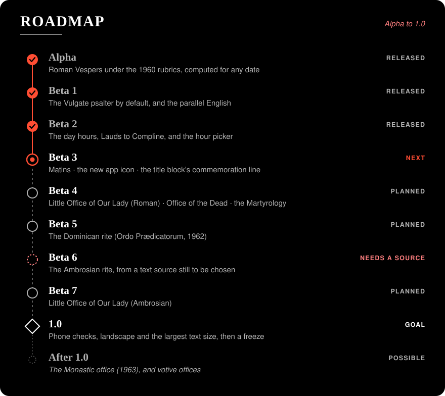

# Roadmap to 1.0

Agreed on 25 September 2026, after Beta 2's release. The picture in the README is
[`images/roadmap.svg`](images/roadmap.svg), drawn by `scripts/roadmap-svg.py`. Each beta
still gets its own plan document (`Beta_N_plan.md`) and approval before any work starts.

## The order, and why

What Divinum Officium (DO) contains decides most of it. DO gives us an oracle: the engine
is checked against DO's own output for every day from 2025 to 2040. Whatever DO contains
can be checked that way, and whatever it lacks cannot.

| Beta | Contents | In DO? | Depends on |
|---|---|---|---|
| **Beta 3** | **Matins**: the three nocturns, lessons and responsories, the *Te Deum*, and the 1960 rules for shortening Matins. **The new app icon**, designed by the user (specs in [`icon-spec.md`](icon-spec.md)). **The title block's commemoration line** (*Commemoratio ad Laudes tantum: …*), carried over from Beta 2. | Yes | Nothing |
| **Beta 4** | **The Little Office of Our Lady** (Roman), **the Office of the Dead**, and **the Martyrology** as an "hour" of its own in the picker. | Yes, with English | Matins, for their Matins |
| **Beta 5** | **The Dominican rite**: DO's *Ordo Prædicatorum - 1962*, with its own calendar, saints and commons. *Ritus: Dominicanus* becomes selectable. | Yes | Matins; the rite plug-in, built here for the first time on a rite that can be checked |
| **Beta 6** | **The Ambrosian rite** (pre-conciliar), from an online text source still to be chosen. | **No** | The source; the rite plug-in, proven in Beta 5 |
| **Beta 7** | **The Little Office of Our Lady** (Ambrosian). | No | Beta 6, and its source |
| **1.0** | A release pass: check every hour and rite on the phone, verify landscape, add hyphenation at the largest text size, then freeze. | | Everything above |
| After 1.0 | Possible: the Monastic office (DO's *Monastic - 1963*), and votive offices where the 1960 rubrics allow them. | Yes | |

- **Matins first:** it completes the Roman office, and both the Little Office and the
  Dominican rite reuse it.
- **The Dominican rite before the Ambrosian:** DO lets us check that the second-rite
  plug-in really works (`CLAUDE.md`, *Rite abstraction*) before we build the rite that can't be
  checked against DO.
- **The Ambrosian rite** can't be checked against DO. Beta 6's plan will set out how it is
  checked instead: sample days checked by hand against the source, with tests that
  record them.

## Decisions (25 September 2026)

1. **Order:** as above. This replaces the earlier order (Beta 3 for the Ambrosian and
   Dominican rites, Beta 4 for Matins) in `Beta_1_plan.md` and `PLAN.md`.
2. **The Martyrology and the Office of the Dead** come with the Little Office in Beta 4.
3. **Ambrosian source:** not chosen yet. It will probably be an online website or text
   source. It is bundled at build time like DO's texts, so the app stays fully offline.
4. **Dominican English:** use DO's Dominican English where DO has it. Where it doesn't
   (DO has English for the Dominican seasonal texts but none for its saints), use the
   Roman English for texts that match the Roman ones. Anything still untranslated shows
   in Latin only.
5. **The next release is 1.0**, at the end of the table above.
6. **The icon** is designed by the user, to the specs in [`icon-spec.md`](icon-spec.md).

## Open questions for later plans

- **Beta 5:** does DO's Dominican office have its own psalter distribution and hymn
  texts, or does it borrow the Roman ones? It decides how much of the Roman provider can
  be shared.
- **Beta 6:** which source and edition, and in what form. The source's licence must let
  us bundle its text, as DO's MIT licence does.
- **Beta 7:** whether the Ambrosian source includes the Little Office, or it needs a
  second source.
